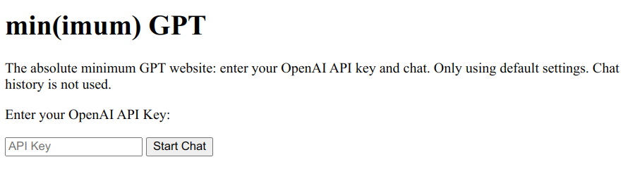

# minGPT
The absolute minimum GPT website: enter your OpenAI API key and chat. Only using default settings. Chat history is not used.
## How to use
1. Download the minGPT.html file.
2. Open it in a browser.
3. Enter your OpenAI API key and click on 'Start Chat'. 
4. Enter your question and click on 'Send'.
5. After chatGPT replies, you can enter another question and click on 'Send'. As described above, for minimalisticity, the chat history is not utilized, so each Q&A is a like a new round of conversation.

## Preview

## Conclusion
That's it! Extremely simple. I do not expect anything simpler than this. Will add some other programs that are a bit more sophisticated later.
